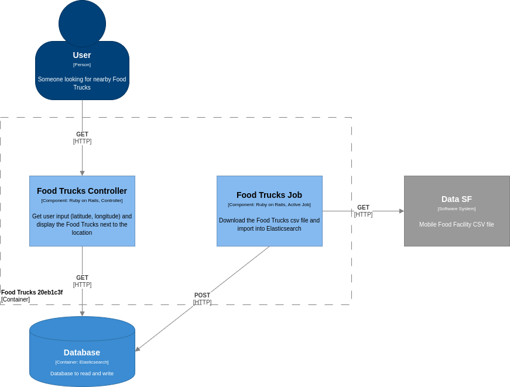

<h1 align="center">
  Food Trucks
</h1>

<p align="center">
  <a href="#rocket-project">Project</a>&nbsp;&nbsp;&nbsp;|&nbsp;&nbsp;&nbsp;
  <a href="#computer-techs">Techs</a>&nbsp;&nbsp;&nbsp;|&nbsp;&nbsp;&nbsp;
  <a href="#thinking-how-to-use">How to use</a>&nbsp;&nbsp;&nbsp;|&nbsp;&nbsp;&nbsp;
  <a href="#memo-license">License</a>
</p>

## :rocket: Project

### Architecture

<p align="center">
  
</p>

### Preview

<p align="center">
  
</p>

## :computer: Techs

- Elasticsearch
- React.js
- Ruby
- Ruby on Rails
- Sidekiq

## :thinking: How to use

```sh
# Clone repository
git clone https://github.com/flaviogf/food_trucks_20eb1c3f.git

# Enter in project directory
cd food_trucks_20eb1c3f

# Start redis, elasticsearch and kibana first
docker-compose up -d redis elasticsearch kibana

# Create food-trucks-v1 index
curl -XPUT 'localhost:9200/food-trucks-v1' -H 'Content-Type: application/json' -d '{
  "mappings": {
    "properties": {
      "food_items": {
        "type": "text"
      },
      "location": {
        "type": "geo_point"
      }
    }
  }
}'

# Start web and job
docker-compose up -d web job

# Application: http://localhost:3000
# Kibana:      http://localhost:5601
# Sidekiq:     http://localhost:3000/sidekiq
```

## :memo: License

This project contains the MIT license. See the file [LICENSE](LICENSE).
